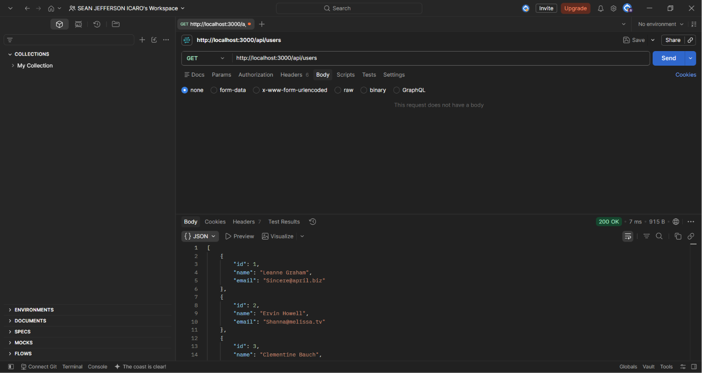
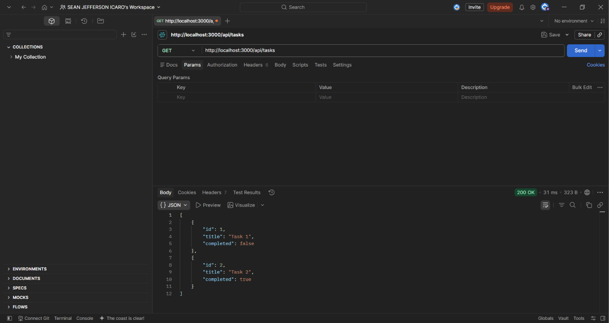
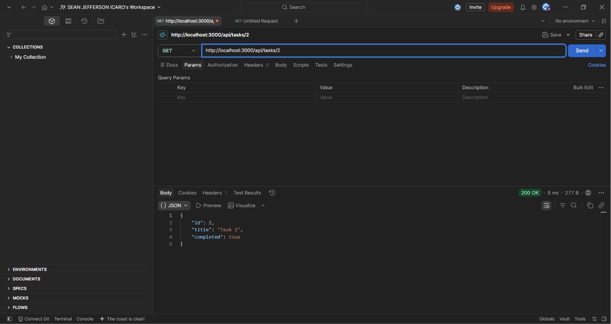
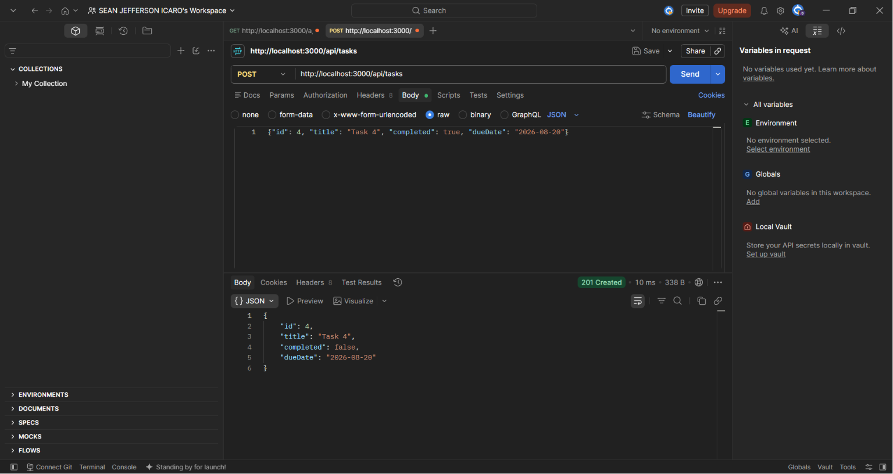
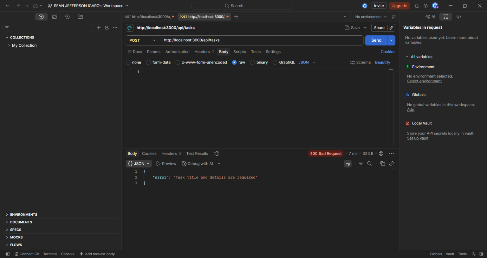
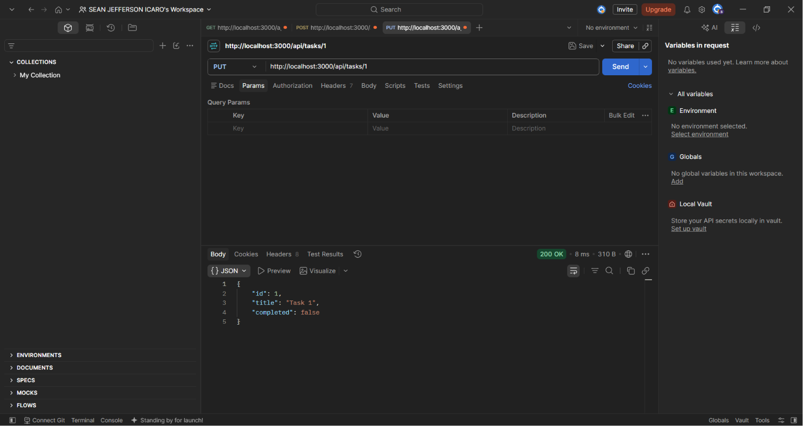
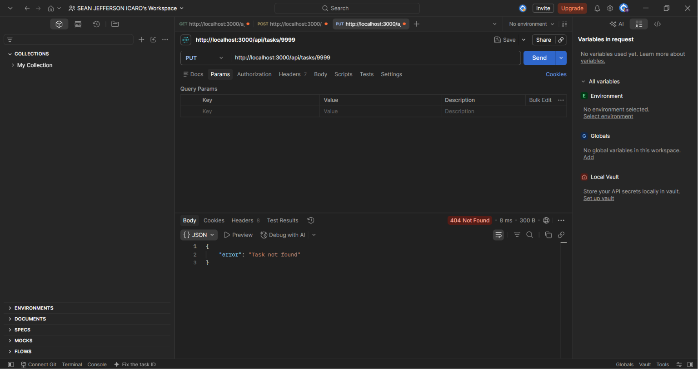
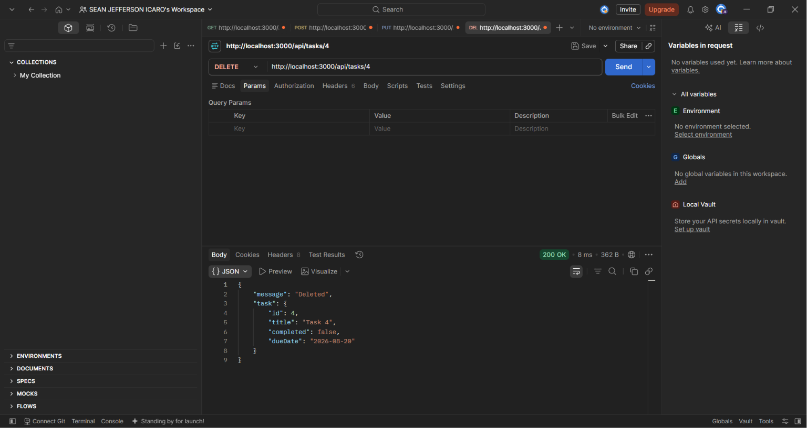
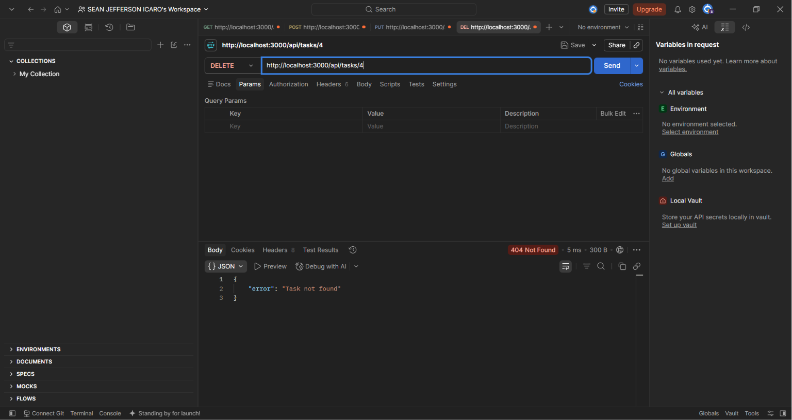

# **it-elect2-project**

My IT Elective 2 backend web development project.

---

**GT1 (July 1)**: Git Foundation (push the itelect2-project repository to GitHub)

**GT2 (July 8)**: Branching and Node.js Setup (create branch, setting up node.js, and ignoring of the .env file)

**GT3 (July 15)**: ES6+ / Advanced JavaScript (create src/utils.js with three named-export arrow functions and import all three functions from ./utils.js and call each one with a sample input, logging the result with console.log)

**GT4 (July 22)**: Async JS and Error Handling (adds async API fetching, custom error handling, and task validation to the project using async/await, Promises, and try/catch blocks)

**GT5 (July 29)**: Node Express

**GT6 (August 5)**: API Testing

**GT7 (August 12)**: Connecting PostgreSQL via Sequelize

---
# API Testing

GET /api/users

GET /api/tasks

GET /api/tasks/:id

POST /api/tasks (with body)

POST /api/tasks (without body)

PUT /api/tasks/:id

PUT /api/tasks/9999

DELETE /api/tasks/:id (first try)

DELETE /api/tasks/:id (second try)